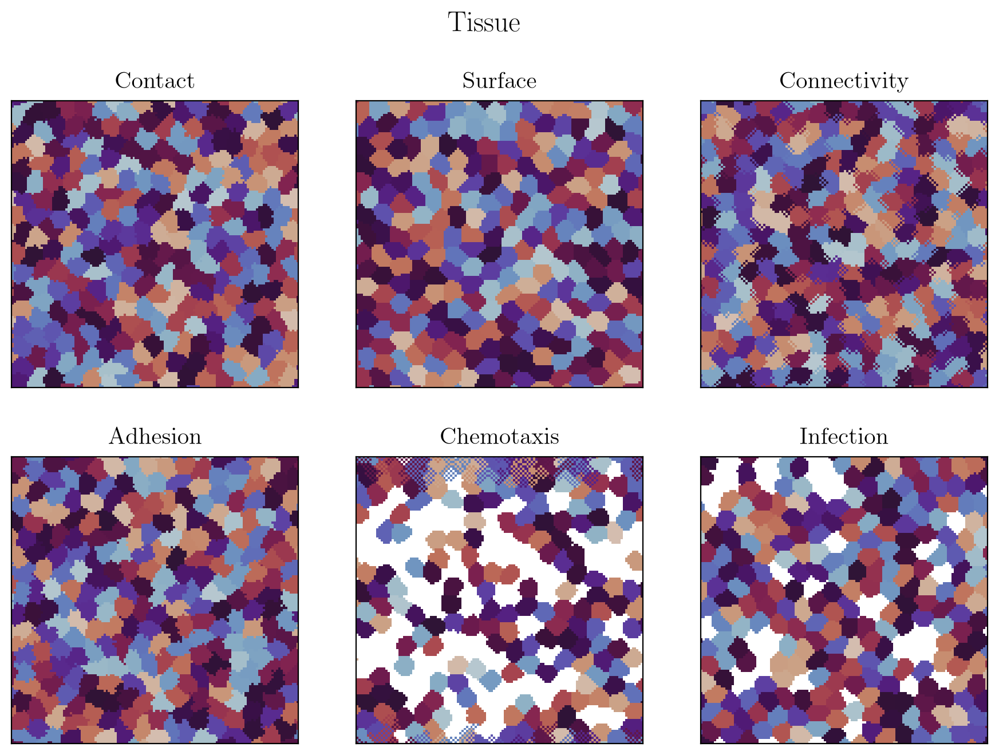
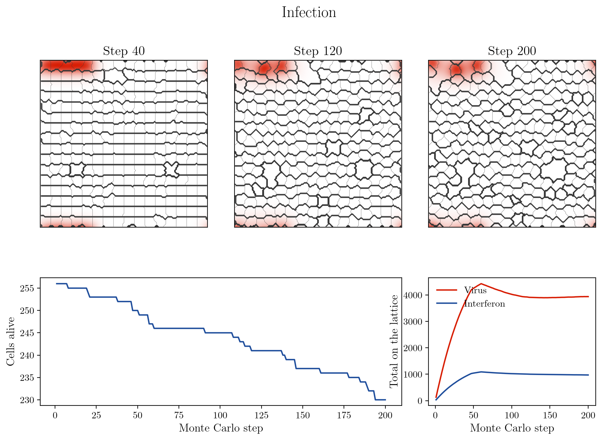
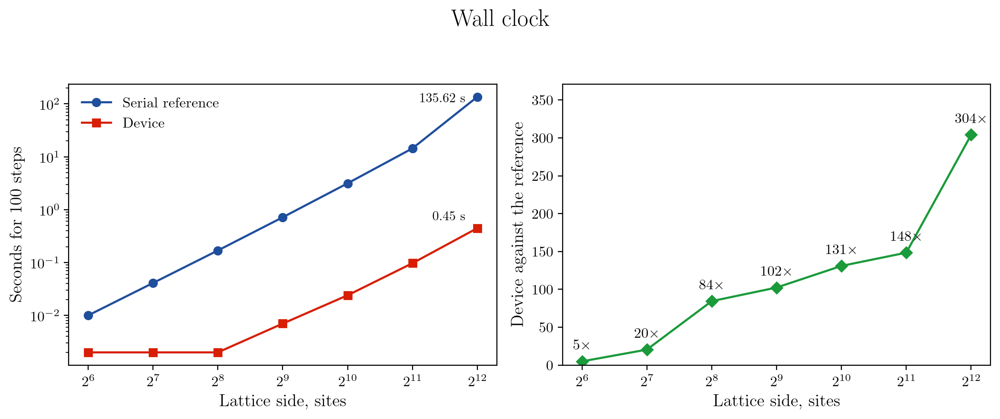
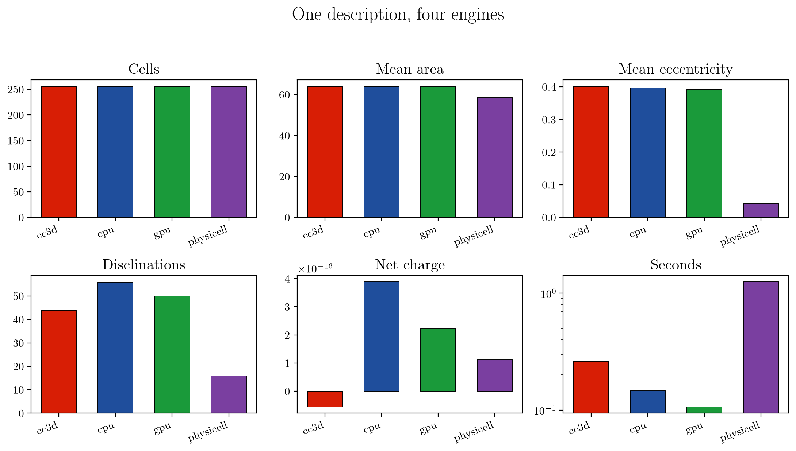
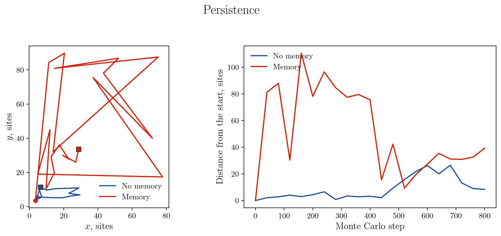

# glazier

Cellular Potts tissue simulation on the CPU and the GPU.

[](https://crates.io/crates/glazier-cpm)
[](https://pypi.org/project/glazier/)
[](https://docs.rs/glazier-cpm)
[](#licence)

A sheet or a block of cells on a periodic lattice, under contact, volume,
surface and length energies, with diffusing chemical fields, chemotaxis,
persistent motility, division, death and a connectivity veto. One JSON
description drives the engine here, CompuCell3D, and PhysiCell for comparison.

Named after James Glazier, whose work with Graner and Hogeweg applied the
Potts lattice to tissue.



## Install

```bash
cargo add glazier-cpm                   # library via `use glazier::...`
cargo install glazier-cpm --features cuda   # binary with CUDA features
pip install glazier                    # Python-side bindings
```

```bash
glazier --model blueprints/monolayer.json --out runs/gpu --engine gpu
```

## Layout

The engine is Rust. The harness that drives the other engines and measures what
they produce is Python. Both read the same descriptions.

| Path | Contents |
|---|---|
| `glazier-core/` | lattice, energies, serial sweep, the Blueprint reader, the `.npy` writer |
| `glazier-cuda/` | the checkerboard sweep on the device |
| `glazier/` | the facade crate and the `glazier` binary |
| `glazier-py/` | PyO3 bindings, built as `glazier._native` |
| `glazier-tests/` | Rust integration tests |
| `python/glazier/` | descriptions, engine backends, measurement |
| `blueprints/` | model descriptions every engine reads |
| `bench/` | the round trip against mermin, and every engine on one description |
| `sims/` | CompuCell3D models written directly, outside the Blueprint path |
| `tests/` | Python tests, including the one that compares the two readers |

A Blueprint is parsed twice, once by serde and once by `glazier.blueprint`.
`tests/test_blueprint_conformance.py` compares them field by field over every
description in the tree, through the compiled module and through the binary.

The Rust side builds with cargo and the Python side runs under pixi, since
CompuCell3D installs from a conda channel and pins its interpreter. `mermin`, my
related cell-image analysis software, keeps its own environment, so the
measurement in `bench/roundtrip.py` reaches it through files.

## Scope

A sheet or a block of cells on a periodic lattice under four energy terms: a
contact energy per unlike-label bond, `lambda (V - V_target)^2` per cell,
`lambda (S - S_target)^2` on the surface counted as bonds to any other label,
and `lambda (L - L_target)^2` on the major axis of the cell's second-moment
ellipse. CompuCell3D writes the first three the same way.

One Monte Carlo step is as many copy attempts as there are sites, after which
the chemical fields diffuse and decay, cells secrete into and take up from the
sites they own, and cells past their division volume split while cells of a
type with a death rate die. A copy that would empty a cell is refused, so a
cell leaves the lattice only by dying.

A cell with a chemotactic sensitivity prices each copy against the field at the
two sites it runs between.

| Description | What it exercises |
|---|---|
| `blueprints/monolayer.json` | contact and volume, on four engines |
| `blueprints/monolayer-surface.json` | the surface term against CompuCell3D's |
| `blueprints/monolayer-physicell.json` | the same model across a geometry class |
| `blueprints/infection.json` | two fields, secretion and uptake, death |
| `blueprints/immune-chemotaxis.json` | a cytokine, chemotaxis, the length term |
| `blueprints/volume.json` | the same engine on a three-dimensional lattice |

Two hundred steps of `infection.json` leave 229 of 256 cells alive with 2914 of
virus and 654 of interferon on the lattice.



## GPU sweep

Two copy attempts are independent when neither target sits in the other's
neighbourhood. Colouring sites by `(x mod 2, y mod 2)` puts same-colour targets
two apart, outside a Moore neighbourhood, so one colour's attempts all run at
once and a step is the four colours in turn.

Note two differences:

- The serial engine draws targets with replacement; the device visits every
  site once per step.
- A cell's volume is read before a copy is priced and written with an atomic
  after, so several accepted copies on one cell within a colour each price
  their move against the same volume.

They therefore agree in distribution. `tests/gpu_matches_cpu.rs` checks cell
count, mean volume and the spread about target, and the spreads stay within a
quarter of each other.

## Benchmarks

100 Monte Carlo steps, cells of side 8, on an RTX 5060 Laptop GPU against one
CPU thread.

| Lattice | Cells | CPU (s) | GPU (s) | Speedup |
|---|---|---|---|---|
| 128 x 128 | 256 | 0.043 | 0.002 | 25 |
| 256 x 256 | 1024 | 0.171 | 0.002 | 77 |
| 512 x 512 | 4096 | 0.772 | 0.007 | 116 |
| 1024 x 1024 | 16384 | 3.146 | 0.024 | 129 |
| 2048 x 2048 | 65536 | 14.402 | 0.097 | 148 |
| 4096 x 4096 | 262144 | 135.620 | 0.446 | 304 |



The kernel is f32 throughout, which suits a card whose fp64 runs at a
seventy-first of its fp32. The CPU reference is f64.

The draws are counter-based: each one is a hash of site, step, colour and
index, so no generator state is stored. A xoshiro256++ state per site
instead moved 64 bytes per site per colour, more traffic than the lattice
itself, and ran 1.7 times slower on a card that is bandwidth-bound.

A short run through the CLI reads slower on the device than these figures,
because the first call compiles the kernel with nvrtc and uploads the lattice.
The CLI reports that setup separately from the steps.

Against CompuCell3D on the same model, 512 by 512 with 4096 cells over 200
steps: CompuCell3D 5.650 s, the serial reference 1.605 s, the device 0.067 s.
That is 84 times CompuCell3D's own wall clock, on a model written the same way
for both.

A coordinate wraps by comparison, since every caller steps one neighbour offset
from a coordinate already in range. A remainder is a division and it sits in the
innermost loop of the sweep, so the change took the serial engine from 4.05 s to
3.15 s at 1024 by 1024.

## Engine comparison

`bench/engines.py` runs `blueprints/monolayer-physicell.json` on
CompuCell3D 4.10, on both glazier engines and on PhysiCell 1.14.2: 128 by 128,
256 cells, 200 steps.

| Quantity | CompuCell3D | glazier CPU | glazier GPU | PhysiCell |
|---|---|---|---|---|
| Cells | 256 | 256 | 256 | 256 |
| Mean area | 64.0 | 64.0 | 64.0 | 58.5 |
| Area rms from target | 1.57 | 1.60 | 1.83 | 5.73 |
| Mean eccentricity | 0.402 | 0.394 | 0.394 | 0.042 |
| Nematic order | 0.093 | 0.065 | 0.073 | 0.164 |
| Disclinations | 44 | 38 | 56 | 16 |
| Net charge | 0.000 | 0.000 | 0.000 | 0.000 |
| Seconds | 0.372 | 0.128 | 0.103 | 1.390 |



Cell count and net charge transfer across all four. Cell shape does not. A
Potts cell is an irregular polygon at eccentricity 0.4 and a PhysiCell agent is
a disc at 0.04, so the orientational quantities in the PhysiCell column describe
its rasterisation.

## Surface term across engines

`blueprints/monolayer-surface.json` adds `lambda_surface` 0.1 at a
target of 34 bonds, and the three lattice engines round their cells by the same
amount.

| Quantity | CompuCell3D | glazier CPU | glazier GPU |
|---|---|---|---|
| Mean eccentricity, no surface term | 0.402 | 0.394 | 0.394 |
| Mean eccentricity, with it | 0.378 | 0.371 | 0.359 |
| Area rms from target | 1.59 | 1.61 | 1.72 |
| Disclinations | 38 | 34 | 44 |

The global nematic order over 256 cells fluctuates by roughly `1/sqrt(N)`, so
that column varies most between runs. Eccentricity and defect count are the
steady ones.

## Three dimensions

A description gives a `depth`, and one is a plane. The lattice, the
neighbourhoods, the field solver, the moments and both engines all take the
third axis. A plane keeps the arithmetic it always had, since every offset with
a nonzero `z` drops out of its neighbourhood and the third variance is zero.

Neighbour orders on a cubic lattice are the six faces, the eighteen faces and
edges, and all twenty-six. In a plane, orders two and three are both the eight
Moore neighbours, the usual meaning in a two-dimensional model.

Two effects come from the dimension itself. Explicit
diffusion is stable to `D dt / dx^2` of a quarter in a plane and a sixth in a
volume, so the same diffusion constant takes half again as many sub-steps. The
device checkerboard likewise needs eight colours where a plane needs four,
since same-colour targets have to stay two apart on every axis.

`blueprints/volume.json`, a 64 by 64 by 32 lattice of 256 cells of 512 sites
with a secreted field, runs 50 steps in 1.60 s on the serial engine and 0.092 s
on the device. `blueprints/infection-volume.json` puts the whole stack in a
slab: an epithelium shedding virus with a death rate, motile immune cells
taking it up and following its gradient, 60 steps in 1.09 s against 0.081 s.

Two terms want different parameters in a volume. A drift moves a 512-site
cell's centroid by a five-hundredth of a site per accepted copy, where a
64-site cell in a plane moves by a sixty-fourth. A site in a volume also has
eighteen neighbours where one in a plane has eight, so the geometric mean the
memory reads drops to zero far more readily: at `max_activity` 20, which moves
a cell three times as far in a plane, a cell in a volume does not move at all,
and it takes 100 before it does. Both are recorded in
`glazier-tests/tests/volume_terms.rs`.

## Device coverage

The device runs every term the serial engine does: contact, volume, surface and
length, the field solver, chemotaxis, division and death. The engines agree on
the tissue they produce, though never bit for bit, since the sweeps are
different chains, and `glazier-tests/tests/` records each agreement as a
measured band.

The field solver is one thread per site over a double buffer, sub-stepped from
the stated diffusion constant like the serial one, and the totals land within
two percent of it on a secreting sheet.

Division and death need a decision per cell over a set of sites scattered across
the lattice. The reductions and the relabelling run on the device: a
circular-mean pass for the centroid, which is single-valued whatever the wrap so
a cell straddling the edge still has one, a second pass for the moments against
it, and a pass that cuts or clears. The decisions cross to the host, where one
entry per cell is thousands of numbers instead of millions. Both counters are
rebuilt from the lattice afterwards, since either event changes every
neighbour's boundary.

The length term prices a copy against a cell's major axis, which no
neighbourhood around the copy can see. The device keeps ten running sums per
cell in a frame each cell's own centroid sets, rebuilt at the top of every step,
and reads the axis from the largest eigenvalue of the three by three in closed
form. Rebuilding every step bounds the f32 accumulation to one step of rounding
instead of a whole run's.

On `blueprints/infection-512.json`, 4096 cells with two fields and a death rate,
200 steps take 9.72 s on the serial engine and 1.66 s on the device, and they
finish within half a percent of each other on cell count. The margin is narrower
than the bare sweep's because the field solve sub-steps and the population step
synchronises once a step.

## Connectivity

A cell that a copy would pinch in two refuses that copy, on either engine. The
test is local. It reads the neighbourhood of the site being taken and asks
whether the sites there belonging to the losing cell fall into one piece.
CompuCell3D walks the cell's whole site graph instead, which is serial by
construction, so the engines refuse different sets of copies while both keep
cells whole, as the description asks.

The condition is sufficient and not necessary. It stops every local pinch, and
a cell can still separate through a sequence of moves that is nowhere locally
disconnecting. On the device the neighbourhood is at most twenty-six positions,
so the test is a bitmask and a bit-wise search, with no array and no local
memory.

`blueprints/monolayer-connected.json` is the worked case: a sheet at a
temperature and a contact energy that tear cells apart when nothing stops them.
Over 200 steps the unconstrained sheet fragments and the constrained one holds
at one piece per cell, on both engines.

The three lattice engines agree there on cell count, mean area, the spread
about target and a net disclination charge of zero, and they part company on
shape. Mean eccentricity reads 0.512 under CompuCell3D's global rule against
0.404 and 0.405 under the local one. Refusing a different set of copies makes a
different tissue, and that is one place where two engines realise one stated
intent differently.

## Polarity

Two ways for a cell to move. Both are priced along the move rather than as
terms in a total energy.

**Memory.** Every site remembers how recently it was taken, and a copy is
priced against the difference in that memory between the two sites it runs
between. A cell that extends in one direction leaves a trail of recent sites
behind its front, and the energy difference favours extending the same way over
turning, so the cell polarises and travels. The neighbourhood average is a
geometric mean, which is zero as soon as one neighbour has forgotten, so the
memory acts as a front. This is the Act model of Niculescu, Textor and de
Boer.

Over 400 steps a cell at `max_activity` 20 and `lambda_activity` 60 travels
more than three times as far as the same cell without it, on either engine, and
stays at its target volume.

**Drift.** A force per axis, whose work is the displacement along it. A cell
with one travels that way whatever its neighbours do, and it wants
`"connected": true` to stay whole while being dragged.



Both want their parameters set against the volume constraint. The memory bonus
is bounded by `lambda_activity`, so a value far past `lambda_volume` inflates
the cell instead of moving it, and a cell driven hard enough can wrap medium
into a ring that the connectivity veto then locks.
`blueprints/immune-motile.json` gives a regime that works.

## Adhesion molecules

A description can name adhesion molecules, say how much of each a type
presents, and give a binding matrix over them, instead of writing out an energy
per pair of types. What two types' molecules bind comes off the contact energy
between them, and since that is a function of the two types alone, it folds
into the contact matrix before an engine ever sees it. The test runs a molecule
description and the matrix it folds to on the same seed, and both reach the same
lattice.

`blueprints/adhesion.json` has an epithelial type presenting cadherin, a
mesenchymal one presenting less cadherin and some integrin, and a two by two
binding matrix. The contact matrix the engine reads comes out at 6.0 between
epithelial cells, 9.5 across the pair and 9.1 between mesenchymal ones, from a
stated 12.0 throughout.

Per-cell adhesion stays out, where two cells of one type present different
amounts and the amounts change as the cell runs. That is state per cell rather
than per type, and it moves during a run, so it belongs to a trajectory instead
of a description.

## Not implemented

- Focal point plasticity: explicit links between cell pairs, with their own
  creation and breaking rules. It is a mutable list per cell, which neither a
  declarative description nor a parallel sweep accommodates well.

## Harness

`python/glazier` reads a description, drives CompuCell3D and PhysiCell through
their own interfaces, and measures whatever any engine produces on one lattice.

| Module | Contents |
|---|---|
| `blueprint.py` | the description, read the way the Rust engine reads it |
| `cc3d_backend.py` | CompuCell3D backend |
| `physicell_backend.py` | PhysiCell backend, and the rasterisation that makes it comparable |
| `director.py` | per-cell ellipse, Q tensor, director, nematic order, disclination charge |
| `render.py` | a label field as a two-channel fluorescence image at microscopy resolution |
| `compare.py` | angle residuals mod pi, and the axis-convention test |

`bench/roundtrip.py` sends a simulated tissue through mermin and scores what it
recovers against a director the model knows exactly: 0.34 degrees median over
121 cells.

## Figures

`pixi run figures` regenerates every image above from runs it makes itself, so
every figure here comes from a run in this repository. The sweep at
the top end takes minutes and its table is cached under `runs/figures`.

## Licence

MIT or Apache-2.0, at your option.
